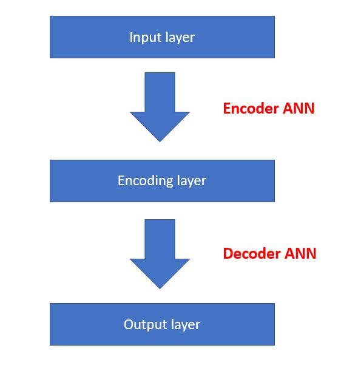
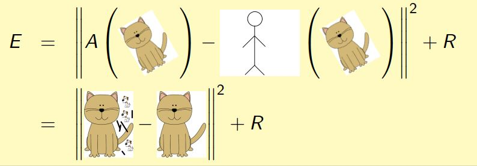
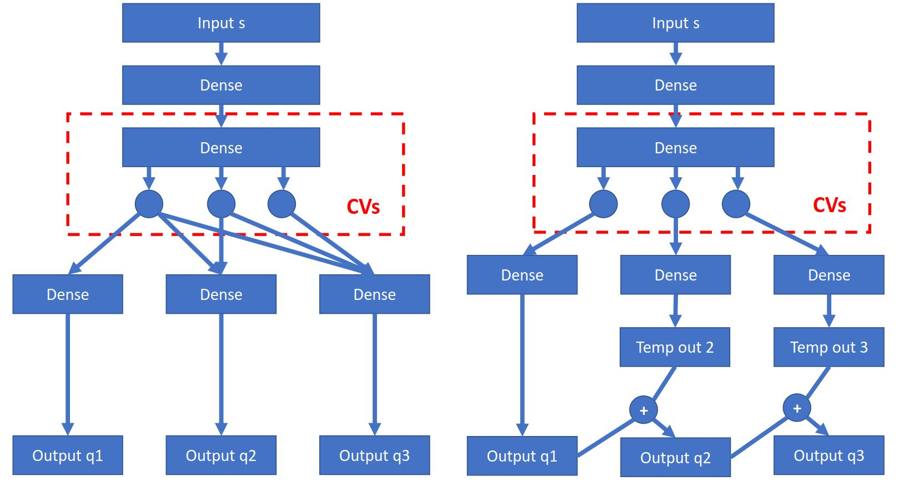

[](https://www.plumed-nest.org/eggs/19/065/)
[](https://opensource.org/licenses/MIT)

# Accelerated sampling with data-augmented autoencoders

This is the framework for running accelerated sampling with data-augmented autoencoders.

## Dependency

OpenMM simulation pacakge: https://github.com/pandegroup/openmm

ANN_Force biasing force package: https://github.com/weiHelloWorld/ANN_Force

Keras: https://github.com/fchollet/keras

PyTorch: https://pytorch.org

MDAnalysis: https://github.com/MDAnalysis/mdanalysis

Nose testing framework: https://github.com/nose-devs/nose

PLUMED (ANN included): https://github.com/plumed/plumed2 + https://github.com/weiHelloWorld/plumed_additional

cluster management: https://github.com/weiHelloWorld/cluster_management

plumed helper: https://github.com/weiHelloWorld/plumed_helper

OpenMM-PLUMED force plugin: https://github.com/peastman/openmm-plumed

Bayes WHAM free energy calculation package: https://bitbucket.org/andrewlferguson/bayeswham_python

Some other Python scientific calculation packages (e.g. seaborn, pandas, sklearn) are also needed, it is recommended to install them with Anaconda: https://www.continuum.io/downloads


## Installation and preparation

No installation is required.  You may simply have all dependent packages installed and checkout this repository.

It is **highly recommended** to run tests before running code to make sure packages are correctly installed.

## Testing

This package uses `nosetest` framework.  To run testing, run

```bash
root_dir=MD_simulation_on_alanine_dipeptide/current_work
cd ${root_dir}/tests
make test
```

Tests include numerical unit tests (for tests with clear expected results) and figure plots (for others, such as neural network training).

## 1-minute quick start

Go ahead to modify configuration file `${root_dir}/src/config.py`, and run 

```bash
python main_work.py
```

For more options, type

```bash
python main_work.py --help
```

## Quick introduction to autoencoders

A typical autoencoder consists of encoder ANN and decoder ANN, where encoder ANN maps inputs to a small number of collective variables (CVs) in encoding layer and decoder ANN tries to reconstruct inputs (or some variants of inputs) from CVs:



A typical 5-layer structure is given below:


For traditional autoencoders, we minimize

$$E=|A(x)-x|^2 + R$$

where $A$ is autoencoder mapping function, $R$ is regularization term.

To remove external degrees of freedom, we use data-augmented autoencoders, which minimizes

$$E=|A(x)-L(x)|^2 + R$$

where $L$ is the alignment function responsible for data augmentation.  It can be written in "cat form" as (cat = molecule configuration, little human = alignment function L):



To possibly remove dependency on specific reference, we apply multiple references to data-augmented autoencoders, corresponding error function is 

$$E=\sum_j |A_j(x)-L_j(x)|^2 + R$$

where $A_j$ are autoencoders that share all but the last layer, and $L_j$ is alignment functions with respect to reference $j$.

If we want to see relative importance among these CVs, we construct multiple outputs with each output taking contribution from some of CVs in encoding layer.  Two possible types of network topology are given below:



Corresponding error function is then

$$E=E_{1}+E_{1,2}+E_{1,2,3}+...$$

where $E_{1}$ is reconstruction error when only 1st CV is used to compute output, $E_{1,2}$ is reconstruction error when only first two CVs are used to compute output, ...

See slides for more information: (TODO)


## Directory structure

Directories are arranged as follows:

```
${root_dir}/src: source code
${root_dir}/target: output of simulation data (pdb files and coordinate files)
${root_dir}/resources: training results (autoencoders), and reference configurations files (pdb files)
${root_dir}/tests: test source code
```


## Extensions

#### 1. apply to new molecules

1. Create a subclass of `Sutils` for the molecule and implement corresponding methods in `${root_dir}/src/molecule_spec_sutils.py`.

2. Include molecule-specific information in the configuration file `${root_dir}/src/config.py`, and modify corresponding configuration settings.

3. Modify biased simulation file (`${root_dir}/src/biased_simulation_general.py`) for the new molecule.

4. Add molecule-related statements to `${root_dir}/src/ANN_simulation.py` and `${root_dir}/src/autoencoders.py` whenever `Trp_cage` appears.

#### 2. use a new neural network architecture or switch to a new training backend

1. Create a subclass of `autoencoder` for the new structure/backend and do implementation.  Note that all abstract methods (`@abc.abstractmethod`) must be implemented.

2. Include new network information in the configuration file `${root_dir}/src/config.py`.

#### 3. apply a new potential center selection algorithm

Modify method `Sutils.get_boundary_points()` in `${root_dir}/src/molecule_spec_sutils.py`.

#### 4. use a new simulation package

Modify `biased_simulation.py` or `biased_simulation_general.py`

## Citation

If you use this code in your work, please cite:

- Chen, Wei, and Andrew L. Ferguson. "Molecular enhanced sampling with autoencoders: On‐the‐fly collective variable discovery and accelerated free energy landscape exploration." Journal of computational chemistry 39.25 (2018): 2079-2102.

- Chen, Wei, Aik Rui Tan, and Andrew L. Ferguson. "Collective variable discovery and enhanced sampling using autoencoders: Innovations in network architecture and error function design." The Journal of chemical physics 149.7 (2018): 072312.

## Contact

For any questions, feel free to contact weichen9@illinois.edu or open a github issue.
